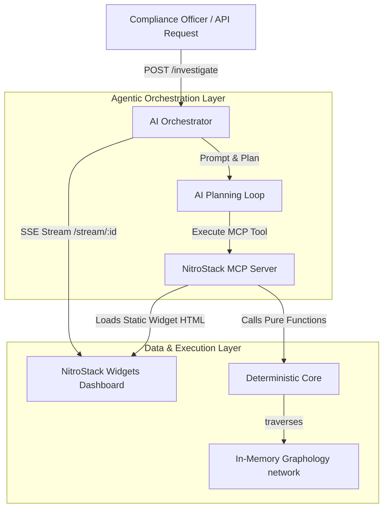

# BruteForce: AI-Orchestrated Beneficial Ownership & UBO Investigation Platform

BruteForce is a state-of-the-art corporate intelligence and regulatory compliance platform designed to unmask Ultimate Beneficial Owners (UBOs) hiding behind complex multi-jurisdictional shell company structures. By combining a 100% pure, deterministic graph computation core with an LLM-powered investigative planner, BruteForce automatically traces control paths, evaluates evidence confidence, checks sanctions registries, and compiles comprehensive compliance dossiers.

---

## Overview

### The Problem
Bad actors, money launderers, and sanctioned entities routinely bypass international compliance checks by layering corporate ownership across offshore jurisdictions (e.g., British Virgin Islands, Cayman Islands, Seychelles). Traditional investigation software is either:
1. **Fully Manual:** Investigators must manually query registries and stitch charts together in drawing tools.
2. **Brittle & Non-Deterministic:** Attempting to run graph traversal using pure generative AI (LLMs) leads to hallucinations, incorrect ownership math, and connections.

### The BruteForce Solution
BruteForce introduces an **agentic hybrid architecture**. 
* **The Core:** A deterministic, zero-I/O graph core handles all heavy mathematical and network analysis operations (DFS pathfinding, Jaro-Winkler entity resolution, shared attribute correlation, and mathematical control percentage aggregation).
* **The Orchestrator:** An autonomous AI planner uses Model Context Protocol (MCP) tools to explore the graph, decide which paths to investigate, evaluate evidence reliability, check sanctions, and write compliance narratives.
* **The Frontend:** Built on **NitroStack Widgets**, providing real-time visual dashboards embedded within the investigator's console.

---

## Features

- **Autonomous Agentic Planner:** An LLM-powered investigator that accepts natural language investigation goals, plans tool executions, loops to gather evidence, and adjudicates the final corporate verdict.
- **Deterministic Entity Resolution:** Jaro-Winkler string similarity matching coupled with identifier blocking (tax IDs, registration numbers) to link duplicate/alias entities without LLM hallucination.
- **Multi-Path ownership Aggregation:** DFS graph algorithms that calculate effective control by multiplying percentages along chains and summing parallel ownership paths.
- **Cross-Registry Sanctions Screening:** Real-time screening of resolved entity networks against OFAC, EU, and UN sanctions watchlists.
- **Shared Attribute Linkage:** Automatic mapping of shared addresses, phone numbers, and emails to unmask hidden relationships between apparently unconnected shell corporations.
- **Trade Consignee Correlation:** Peer-to-peer import/export cargo manifest analysis to flag shared shipping partners and trade dependencies.
- **Deterministic Evidence Reliability Scoring:** Evaluates dataset provenance tiers (Registry, ICIJ Leaks, Self-Reported), recency, and completeness to generate a mathematical confidence index for every control edge.
- **Interactive UI Widgets (NitroStack SDK):**
  - **Evidence Graph Widget:** Interactive visualization of ownership paths and percentages with on-click source-card inspection.
  - **Dossier & SAR View:** Structured report layout highlighting target entities, UBO status, sanctions hits, and regulatory action items.
  - **Source Card Widget:** A breakdowns of confidence levels and evidence provenance.
  - **Planner Log Stream:** A live, scrolling terminal streaming Server-Sent Events (SSE) from the AI Orchestrator's planning loop.

---

## Tech Stack

- **Languages:** TypeScript (ES2022 / NodeNext Module Resolution), HTML5, CSS3
- **Frameworks & Runtimes:** Node.js (>=20.0.0), Next.js (15.5.x), Express.js (5.x)
- **Agentic Infrastructure:** Model Context Protocol (MCP) SDK, Anthropic Claude 3.5 Sonnet API
- **UI Framework & Widget SDK:** NitroStack Core & Widgets SDK (TypeScript)
- **Graph Mathematics:** Graphology (high-performance JS/TS graph theory library)
- **Deployment & Containers:** Docker, Alpine Linux, NitroCloud

---

## Project Structure

```text
BruteForce/
├── packages/
│   ├── core/                    # Pure, deterministic algorithms (0 LLM, 0 I/O)
│   │   ├── src/algorithms/      # UBO DFS, entity resolution, sanctions matching, scoring
│   │   └── src/graph/           # In-memory graph manager
│   │
│   ├── orchestrator/            # Express server running AI planning & SSE streams
│   │   └── src/planner.ts       # AI planning loop calling MCP tools
│   │
│   └── mcp-server/              # NitroStack MCP server exposing tools to the AI
│       └── src/
│           ├── modules/         # Tools, prompts, and resources definitions
│           └── widgets/         # Next.js widgets static sub-project
│               └── app/         # dossier-view, evidence-graph, planner-log, source-card
│
├── data/seed/                   # Mock registry, sanctions list, and trade logs
├── deploy.md                    # Architectural Docker pipeline build instructions
├── package.json                 # Monorepo workspaces definition
└── README.md                    # Hackathon submission documentation
```

---

## Installation

### Prerequisites
* Node.js >= 20.x
* npm >= 10.x
* Anthropic Claude API Key (set in environment)

### Setup Instructions

1. **Clone the Repository:**
   ```bash
   git clone <repository-url>
   cd BruteForce
   ```

2. **Configure Environment Variables:**
   Create a `.env` file in `packages/orchestrator/`:
   ```env
   ANTHROPIC_API_KEY=your_claude_api_key_here
   ORCHESTRATOR_PORT=3002
   ```

3. **Install Dependencies:**
   Install monorepo and widget dependencies:
   ```bash
   npm install
   ```

4. **Build the Entire Project:**
   This compiles all TypeScript packages, installs Next.js widget dependencies, and generates the static HTML outputs for the NitroStack server:
   ```bash
   npm run build
   ```

5. **Start the Application:**
   Start the MCP server and the AI Orchestrator:
   ```bash
   npm start
   ```

---

## Usage

### Running an Investigation
To kick off an autonomous beneficial ownership investigation, send a POST request to the Orchestrator:

```bash
curl -X POST http://localhost:3002/investigate \
  -H "Content-Type: application/json" \
  -d '{"target": "Viktorov Capital Inc"}'
```

This returns an `investigation_id`:
```json
{"investigation_id": "8c45fd8e-738d-4ba6-8a03-62529ab4bc32"}
```

### Viewing Live Agent Logs
To stream the live decision-making process of the AI investigator, connect to the Server-Sent Events (SSE) endpoint or open the **Planner Log Widget** in your browser:
```bash
curl http://localhost:3002/stream/8c45fd8e-738d-4ba6-8a03-62529ab4bc32
```

---

## Architecture

VEILBREAKER uses a clean, layered architectural boundary to ensure auditability, security, and predictability:



1. **Deterministic Core:** Contains mathematical functions that compute ownership and screen lists. No external network requests or model generations occur in this layer, ensuring reliable, reproducible results.
2. **MCP Server:** Exposes the core algorithms as standard tools to the agent, annotating tools with `@Widget` decorators so the UI knows which widget renders which tool's output.
3. **AI Orchestrator:** Instantiates the planner loop. It analyzes the target, executes tools to expand the network, verifies sanctions, and saves the audit trails.
4. **NitroStack Dashboard:** Embedded widgets read data outputs directly from the tools via the `@nitrostack/widgets` SDK hook, eliminating the need to write backend API layers for the frontend.

---

## Challenges & Solutions

### 1. Docker Build Flat-Glob Dependency Failure
* **Challenge:** The NitroCloud deployment pipeline executes `npm ci` after copying only the root-level `package*.json` files. In a monorepo structure, workspace directories do not exist during this stage, preventing npm from reading subpackage workspace dependencies and resulting in `tsc: command not found` (exit code 127).
* **Solution:** We updated the root `build` script to prepend `npm install`. This forces npm to run a workspace-aware dependency resolution phase *after* `COPY . .` has copied the directories into the container.

### 2. Next.js Static Export Route Resolution
* **Challenge:** `@nitrostack/core` scans `src/widgets/out/<route>/index.html` on startup to bind widgets. Default `next build` commands do not output static HTML files, and flat routing options produce `out/evidence-graph.html` instead of the directory format expected by the MCP server.
* **Solution:** Configured `output: 'export'` and `trailingSlash: false` in the Next.js configurations to enforce flat HTML exports corresponding directly to the component ID lookup pattern.

---

## Future Improvements

- **Cross-Border Corporate Registry Scrapers:** Add real-time scraper tasks to fetch direct filings from jurisdictions without pre-seeded data.
- **Dynamic Weight Fine-Tuning:** Let compliance officers override evidence score weights (e.g. raise or lower penalty weights for self-reported vs offshore leak datasets).
- **Federated MCP Network:** Support running federated queries across multiple distributed compliance MCP servers.

---

## Contributors

* **Adithya Narayanan S** / **Adithya Narayanan** (adithya.on13@gmail.com)
* **Anand Rodriguez Menon** (anandrodriguezmenon@gmail.com)
* **Lakshmi.V.S** (lakshmivs798@gmail.com)
* **Mehrinnn** (mehrinas1234@gmail.com)
