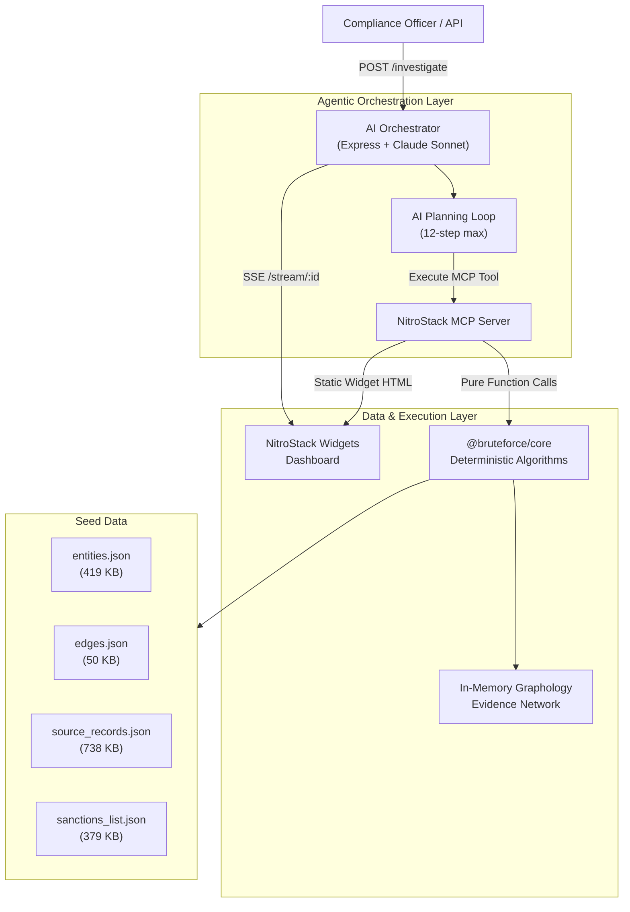

# 🛡️ BruteForce — Hackathon Submission

> **AI-Orchestrated Beneficial Ownership & UBO Investigation Platform**

---

## Table of Contents

1. [Team](#team)
2. [Problem Statement](#problem-statement)
3. [Our Solution](#our-solution)
4. [Key Innovation: The Hybrid Architecture](#key-innovation-the-hybrid-architecture)
5. [Features](#features)
6. [Architecture](#architecture)
7. [Tech Stack](#tech-stack)
8. [Project Structure](#project-structure)
9. [Core Algorithms — Deep Dive](#core-algorithms--deep-dive)
10. [MCP Tools Exposed to the AI](#mcp-tools-exposed-to-the-ai)
11. [Interactive UI Widgets](#interactive-ui-widgets)
12. [How It Works — End-to-End Flow](#how-it-works--end-to-end-flow)
13. [Challenges & Solutions](#challenges--solutions)
14. [Demo / Getting Started](#demo--getting-started)
15. [Testing](#testing)
16. [Future Roadmap](#future-roadmap)
17. [Repository](#repository)

---

## Team

| Name | Email |
|------|-------|
| **Adithya Narayanan S** | adithya.on13@gmail.com |
| **Anand Rodriguez Menon** | anandrodriguezmenon@gmail.com |
| **Lakshmi V.S** | lakshmivs798@gmail.com |
| **Mehrinnn** | mehrinas1234@gmail.com |

---

## Problem Statement

Bad actors, money launderers, and sanctioned entities routinely bypass international compliance checks by layering corporate ownership across offshore jurisdictions (e.g., British Virgin Islands, Cayman Islands, Seychelles). Traditional investigation software falls into two traps:

1. **Fully Manual:** Investigators must manually query registries, stitch together corporate charts, and trace chains of ownership by hand — a process that takes days or weeks per investigation.

2. **Brittle & Non-Deterministic:** Pure LLM-based approaches attempt graph traversal using generative AI, leading to **hallucinated ownership percentages**, **fabricated entity connections**, and **unreliable sanctions matches**. When regulatory compliance is on the line, a wrong number can trigger (or miss) a multi-million-dollar enforcement action.

**The result:** Shell companies hiding ultimate beneficial owners remain undetected, and compliance teams are overwhelmed.

---

## Our Solution

**BruteForce** is an agentic investigation platform that unmasks Ultimate Beneficial Owners (UBOs) hiding behind complex multi-jurisdictional shell company structures. It combines:

- A **100% pure, deterministic graph computation core** (zero LLM involvement in any mathematical operation)
- An **LLM-powered autonomous investigative planner** that decides *what* to investigate next
- **Interactive NitroStack widgets** for real-time visual dashboards

The AI *never* computes a number, resolves an entity, or evaluates sanctions. It only *coordinates* — selecting which deterministic tool to run next, evaluating whether evidence is sufficient, and compiling the final dossier.

> **If it didn't come from a tool, it's not a fact.**

---

## Key Innovation: The Hybrid Architecture

Most AI projects are either fully manual or fully LLM-driven. BruteForce's innovation is a **strict separation of concerns**:

| Layer | Responsibility | LLM Involvement |
|-------|---------------|-----------------|
| **Deterministic Core** (`@bruteforce/core`) | All math, graph traversal, string matching, scoring | ❌ **None** |
| **MCP Server** (`veilbreaker-mcp`) | Exposes core algorithms as standardized tools | ❌ **None** |
| **AI Orchestrator** (`@bruteforce/orchestrator`) | Plans investigation steps, selects tools, assembles narrative | ✅ Claude Sonnet |
| **UI Widgets** (NitroStack) | Real-time dashboards showing investigation progress | ❌ **None** |

**Why this matters:**
- Every ownership percentage is **mathematically computed** (DFS path multiplication + parallel summation), never estimated by an LLM
- Every entity match uses **Jaro-Winkler similarity** with weighted multi-field scoring, never hallucinated
- Every sanctions hit is a **deterministic fuzzy match** against real watchlists, never inferred
- The LLM's role is limited to being an **investigative coordinator** — it reads tool outputs and decides what to investigate next

---

## Features

### 🔍 Autonomous Agentic Planner
An LLM-powered investigator that accepts natural language investigation goals (`"Investigate Viktorov Capital Inc"`), plans tool executions, loops to gather evidence, and produces a compliance verdict — all autonomously.

### 🧬 Deterministic Entity Resolution
Three-phase matching pipeline:
1. **Blocking** — jurisdiction-based candidate filtering
2. **Multi-field scoring** — weighted Jaro-Winkler similarity across name (0.45), identifiers (0.30), address (0.15), jurisdiction (0.10)
3. **Thresholding** — classification into `definite_match`, `probable_match`, `possible_match`, or `no_match`

### 📊 Multi-Path Ownership Aggregation
DFS graph algorithms that:
- Find **all** ownership paths between any two entities
- **Multiply** percentages along each chain (e.g., 60% × 40% = 24% effective)
- **Sum** parallel paths for total effective control
- Flag entities exceeding the **25% UBO regulatory threshold**

### 🚨 Cross-Registry Sanctions Screening
Real-time screening of resolved entity networks against OFAC, EU, and UN sanctions watchlists using Jaro-Winkler fuzzy matching with configurable thresholds.

### 🔗 Shared Attribute Linkage
Automatic mapping of shared addresses, phone numbers, registration IDs, and emails to unmask hidden relationships between apparently unconnected shell corporations.

### 🚢 Trade Consignee Correlation
Peer-to-peer import/export cargo manifest analysis to flag shared shipping partners and trade dependencies across entity networks.

### 📏 Evidence Reliability Scoring
Evaluates dataset provenance tiers (Registry → ICIJ Leaks → Self-Reported), recency, field completeness, and corroboration to generate a mathematical confidence index for every control edge.

### 🖥️ Interactive UI Widgets (NitroStack SDK)
Five real-time dashboard widgets:

| Widget | Description |
|--------|-------------|
| **Evidence Graph** | Interactive ownership path visualization with click-to-inspect confidence scoring |
| **Dossier & SAR View** | Structured compliance report with UBO status, sanctions hits, and regulatory actions |
| **Source Evidence Card** | Evidence provenance breakdown with confidence levels |
| **Planner Log Stream** | Live SSE terminal streaming the AI Orchestrator's decision-making process |
| **Entity Resolver** | Entity resolution results with similarity scores and matched features |

---

## Architecture



### Layer Descriptions

1. **Deterministic Core (`@bruteforce/core`):** Pure TypeScript functions operating on an in-memory Graphology network. Zero I/O, zero network calls, zero LLM. Contains 9 algorithmic modules and 7 test suites.

2. **MCP Server (`veilbreaker-mcp`):** Wraps core algorithms as Model Context Protocol tools using `@nitrostack/core` decorators. Serves pre-rendered Next.js widget HTML. Exposes investigation playbook prompts.

3. **AI Orchestrator (`@bruteforce/orchestrator`):** Express.js server hosting the planner loop. Spawns an MCP client (STDIO or HTTP transport), feeds investigation state to Claude Sonnet, executes tool calls, streams SSE events, and runs the explainer phase to generate SAR narratives.

4. **NitroStack Dashboard:** 5 embedded widgets reading tool outputs via `@nitrostack/widgets` SDK hooks — no custom backend API needed.

---

## Tech Stack

| Category | Technology |
|----------|-----------|
| **Language** | TypeScript (ES2022 / NodeNext) |
| **Runtime** | Node.js ≥ 20.0.0 |
| **Frameworks** | Next.js 15.5.x, Express.js 5.x |
| **AI / Agentic** | Anthropic Claude Sonnet, MCP SDK (`@modelcontextprotocol/sdk`) |
| **UI** | NitroStack Core & Widgets SDK |
| **Graph Engine** | Graphology (high-performance JS/TS graph library) |
| **String Matching** | Custom Jaro-Winkler implementation |
| **Testing** | Vitest |
| **Deployment** | Docker (Alpine Linux), NitroCloud |
| **Monorepo** | npm Workspaces |

---

## Project Structure

```
BruteForce/
├── packages/
│   ├── core/                        # Pure, deterministic algorithms (0 LLM, 0 I/O)
│   │   ├── src/
│   │   │   ├── algorithms/          # 9 algorithm modules
│   │   │   │   ├── resolve-entity.ts       # 551 lines — 3-phase entity resolution
│   │   │   │   ├── all-control-paths.ts    # DFS ownership path discovery
│   │   │   │   ├── compute-control.ts      # Effective control % aggregation
│   │   │   │   ├── score-evidence.ts       # Deterministic confidence scoring
│   │   │   │   ├── find-shared-attributes.ts # Shared address/ID/email linkage
│   │   │   │   ├── co-consignee-links.ts   # Trade consignee correlation
│   │   │   │   ├── match-sanctions.ts      # OFAC/EU/UN sanctions screening
│   │   │   │   └── assemble-dossier.ts     # Final compliance dossier assembly
│   │   │   ├── graph/
│   │   │   │   └── graph-manager.ts        # In-memory Graphology wrapper
│   │   │   ├── models/              # Domain models
│   │   │   ├── utils/               # Jaro-Winkler, string normalization
│   │   │   └── types.ts             # 24 KB of typed domain contracts
│   │   └── tests/                   # 7 comprehensive test suites
│   │
│   ├── orchestrator/                # AI investigation engine
│   │   ├── src/
│   │   │   ├── planner.ts           # 511-line AI planning loop
│   │   │   ├── server.ts            # Express server + SSE streaming
│   │   │   ├── adjudicator.ts       # Veil-piercing verdict logic
│   │   │   └── logger.ts            # Structured logging
│   │   └── prompts/
│   │       ├── investigation_playbook.md   # AI planner system prompt
│   │       └── explanation_playbook.md     # SAR narrative generator prompt
│   │
│   ├── mcp-server/                  # NitroStack MCP server
│   │   ├── src/
│   │   │   ├── modules/investigation/      # Tool, prompt, resource definitions
│   │   │   ├── services/            # Graph loading service
│   │   │   └── widgets/             # Next.js sub-project
│   │   │       └── app/
│   │   │           ├── evidence-graph/     # Interactive graph widget
│   │   │           ├── dossier-view/       # Compliance report widget
│   │   │           ├── source-card/        # Evidence provenance widget
│   │   │           ├── planner-log/        # Live SSE terminal widget
│   │   │           └── entity-resolver/    # Entity match widget
│   │   └── widget-manifest.json     # Widget metadata & example data
│   │
│   └── data/
│       └── seed/                    # Investigation datasets
│           ├── entities.json        # 419 KB — corporate entity registry
│           ├── edges.json           # 50 KB  — ownership relationships
│           ├── source_records.json  # 738 KB — evidence provenance records
│           ├── sanctions_list.json  # 379 KB — OFAC/EU/UN watchlists
│           └── planted_case.json    # Pre-built demo investigation case
│
├── package.json                     # Monorepo workspaces definition
├── deploy.md                        # Docker pipeline documentation
└── README.md                        # Project documentation
```

---

## Core Algorithms — Deep Dive

### 1. Entity Resolution (`resolve-entity.ts` — 551 lines)

**Problem:** Given a name like `"Viktorov Capital"`, which entity in a dataset of thousands is the correct match?

**Approach:** Three-phase deterministic pipeline:

| Phase | Description |
|-------|-------------|
| **Blocking** | Optional jurisdiction filter to reduce candidate set |
| **Multi-Field Scoring** | Weighted composite score across 4 fields |
| **Thresholding** | Classify matches as definite/probable/possible/none |

**Field Weights:**

| Field | Method | Weight |
|-------|--------|--------|
| Name | max(exact=1.0, normalized=0.95, Jaro-Winkler) | 0.45 |
| Identifiers | Any exact overlap → 1.0 | 0.30 |
| Address | max(normalized exact=1.0, Jaro-Winkler) | 0.15 |
| Jurisdiction | Exact match → 1.0 | 0.10 |

Weights are **re-normalized** when fewer fields are provided, preventing unfair penalization.

### 2. All Control Paths (`all-control-paths.ts`)

DFS traversal of the Graphology evidence graph to discover every ownership chain between two entities. Each path records every intermediate node and the ownership percentage at each edge.

### 3. Compute Control (`compute-control.ts`)

For each path: **multiply** edge percentages along the chain.  
Across paths: **sum** effective percentages.  
Flag if total exceeds the **25% regulatory UBO threshold**.

*Example: Path A (60% × 40% = 24%) + Path B (15% × 80% = 12%) = 36% effective control → UBO confirmed.*

### 4. Score Evidence (`score-evidence.ts`)

Deterministic confidence scoring evaluating:
- **Dataset provenance tier** (Corporate Registry > ICIJ Leaks > Self-Reported)
- **Record recency** (newer = higher weight)
- **Field completeness** (more fields = higher confidence)
- **Corroboration** (multiple independent sources confirming the same fact)

### 5. Sanctions Matching (`match-sanctions.ts`)

Jaro-Winkler fuzzy matching against OFAC, EU, and UN sanctions lists. Configurable similarity threshold to balance precision vs. recall.

### 6. Shared Attribute Linkage (`find-shared-attributes.ts`)

Maps shared identifiers (addresses, phone numbers, registration IDs, emails) across entities to reveal hidden connections between apparently unrelated shell companies.

### 7. Co-Consignee Links (`co-consignee-links.ts`)

Analyzes import/export cargo manifests to identify entities that share shipping partners — a common indicator of concealed financial networks.

### 8. Assemble Dossier (`assemble-dossier.ts`)

Compiles all investigation findings into a structured compliance dossier containing: investigation summary, effective ownership breakdown, evidence confidence assessment, sanctions matches, and regulatory action recommendations.

---

## MCP Tools Exposed to the AI

The AI Orchestrator communicates with the deterministic core exclusively through the MCP protocol. The following tools are available:

| MCP Tool | Core Function | Widget |
|----------|---------------|--------|
| `resolve_entity` | Entity resolution with Jaro-Winkler matching | Entity Resolver |
| `all_control_paths` | DFS ownership path discovery | Evidence Graph |
| `compute_control` | Effective control % calculation | Evidence Graph |
| `score_evidence` | Deterministic confidence scoring | Source Card |
| `find_shared_attributes` | Shared identifier linkage | Evidence Graph |
| `co_consignee_links` | Trade consignee correlation | Evidence Graph |
| `match_sanctions` | OFAC/EU/UN sanctions screening | Dossier View |
| `assemble_dossier` | Final compliance dossier assembly | Dossier View |

The AI planner also uses two **MCP Prompts** loaded from markdown playbooks:
- `investigation_playbook` — Guides the planner's investigation loop
- `explanation_playbook` — Generates human-readable SAR narratives from dossier facts

---

## Interactive UI Widgets

All widgets are built with React + NitroStack Widgets SDK and rendered as static HTML exports served by the MCP server.

### Evidence Graph Widget
- Renders ownership paths as interactive node-and-edge chains
- Click any edge arrow to trigger live `score_evidence` tool call
- Displays Source Card overlay with confidence score and provenance explanation

### Dossier & SAR View
- Structured compliance report layout
- Highlights: target entity, UBO status, effective control percentage, threshold evaluation
- Sanctions matches with OFAC rationale
- Regulatory action recommendations (EDD, transaction halt, etc.)

### Source Evidence Card
- Evidence provenance breakdown per edge
- Dataset source, reliability tier, record ID
- Confidence score with color-coded level indicator (HIGH/MEDIUM/LOW)

### Planner Log Stream
- Live SSE terminal streaming the AI Orchestrator's decision-making process in real-time
- Shows each planning step, tool selection rationale, and tool results
- Scrolling terminal aesthetic with timestamped events

### Entity Resolver Widget
- Displays entity resolution results with similarity scores
- Shows matched features (name, jurisdiction, identifiers)

---

## How It Works — End-to-End Flow

```
1. Compliance officer sends: POST /investigate { "target": "Viktorov Capital Inc" }
                                          │
2. Orchestrator creates investigation session, connects MCP client
                                          │
3. Planner loop begins (max 12 steps):
   │
   ├── Step 1: resolve_entity("Viktorov Capital Inc")
   │           → 3 candidate matches, best: entity-vik-cap (score 0.95)
   │
   ├── Step 2: all_control_paths(root="entity-vik-cap")
   │           → 2 ownership chains discovered through 4 intermediaries
   │
   ├── Step 3: compute_control(root="entity-vik-cap", target="entity-target-llc")
   │           → Effective control: 36% (exceeds 25% threshold ✓)
   │
   ├── Step 4: find_shared_attributes("entity-vik-cap")
   │           → Shared registered address with 2 additional BVI shells
   │
   ├── Step 5: match_sanctions("Viktorov Capital Inc")
   │           → OFAC SDN List match (score 0.95) — Executive Order 14024
   │
   ├── Step 6: score_evidence(edge_ids=[...])
   │           → Aggregate confidence: 88% (HIGH)
   │
   └── Step 7: STOP — "Veil pierced. UBO identified with high confidence."
                                          │
4. assemble_dossier() → Comprehensive compliance report
                                          │
5. Explainer generates SAR narrative from dossier facts
                                          │
6. Results streamed via SSE to all connected dashboard widgets
```

---

## Challenges & Solutions

### 1. Docker Build Flat-Glob Dependency Failure

| | |
|---|---|
| **Challenge** | NitroCloud's Dockerfile runs `npm ci` with only root-level `package.json` files. Workspace subdirectories don't exist yet, so workspace dependencies (graphology, @nitrostack/core, etc.) are never installed. `tsc` fails with `command not found`. |
| **Solution** | Prepended `npm install` to the root `build` script. This runs *after* `COPY . .` brings in all workspace dirs, properly resolving all 268+ workspace dependencies. |

### 2. Next.js Static Export Route Resolution

| | |
|---|---|
| **Challenge** | `@nitrostack/core` expects widget HTML at `out/<route>/index.html`. Default `next build` produces server-side rendering artifacts, not static HTML files. |
| **Solution** | Configured `output: 'export'` and `trailingSlash: true` in Next.js config to produce directory-based static HTML exports matching NitroStack's lookup pattern. |

### 3. Preventing LLM Hallucination in Critical Calculations

| | |
|---|---|
| **Challenge** | LLMs confidently produce wrong ownership percentages, fabricated entity matches, and false sanctions hits — unacceptable for regulatory compliance. |
| **Solution** | Strict architectural boundary: the LLM *never* touches numbers. All calculations, matching, and scoring happen in the deterministic core. The planner's system prompt enforces: *"If it didn't come from a tool, it's not a fact."* |

### 4. TypeScript Multi-Project Compilation

| | |
|---|---|
| **Challenge** | MCP server (`NodeNext` module resolution + decorators) and widgets (`JSX preserve` + `esnext`) produce conflicting TypeScript errors when compiled together. |
| **Solution** | Excluded `src/widgets` from the MCP server's `tsconfig.json`. Widgets are compiled independently via their own Next.js build step. |

---

## Demo / Getting Started

### Prerequisites
- Node.js ≥ 20.x
- npm ≥ 10.x
- Anthropic Claude API Key

### Quick Start

```bash
# 1. Clone
git clone https://github.com/Adithya-N-S/BruteForce.git
cd BruteForce

# 2. Configure API key
echo "ANTHROPIC_API_KEY=your_key_here" > packages/orchestrator/.env

# 3. Install & Build
npm install
npm run build

# 4. Start
npm start
```

### Run an Investigation

```bash
# Kick off autonomous investigation
curl -X POST http://localhost:3002/investigate \
  -H "Content-Type: application/json" \
  -d '{"target": "Viktorov Capital Inc"}'

# Returns: {"investigation_id": "8c45fd8e-..."}

# Stream live planner decisions
curl http://localhost:3002/stream/8c45fd8e-...
```

---

## Testing

The deterministic core has **7 comprehensive test suites** covering all algorithmic modules:

| Test Suite | File |
|-----------|------|
| String Similarity (Jaro-Winkler) | `string-similarity.test.ts` |
| All Control Paths (DFS) | `all-control-paths.test.ts` |
| Compute Control | `compute-control.test.ts` |
| Score Evidence | `score-evidence.test.ts` |
| Find Shared Attributes | `find-shared-attributes.test.ts` |
| Co-Consignee Links | `co-consignee-links.test.ts` |
| Assemble Dossier | `assemble-dossier.test.ts` |

```bash
# Run all tests
cd packages/core
npm test
```

---

## Future Roadmap

- **Cross-Border Corporate Registry Scrapers:** Real-time scraper tasks to fetch direct filings from jurisdictions without pre-seeded data
- **Dynamic Weight Fine-Tuning:** Let compliance officers override evidence score weights (e.g., raise/lower penalty for self-reported vs. offshore leak datasets)
- **Federated MCP Network:** Distributed queries across multiple compliance MCP servers for cross-organizational investigations

---

## Repository

**GitHub:** [https://github.com/Adithya-N-S/BruteForce](https://github.com/Adithya-N-S/BruteForce)

**License:** MIT

---

*Built with ❤️ by Team BruteForce*
